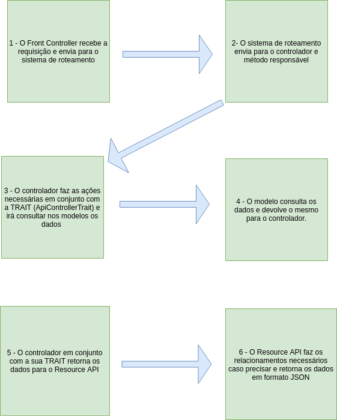

# API Gestão de Descontos

## Especificações tecnologicas do projeto
* Laravel 5.7;
* MYSQL 5.7;
* PHP Fpm 7.1;
* NGINX 1.13.

## Ambiente de desenvolvimento local
O ambiente de desenvolvimento local, utiliza o docker. Foi criada uma estrutura personalizada atráves de imagens oficiais do docker, divida em 4 partes:

1. api.dockerfile (Utiliza a imagem oficial do php-fpm 7.1 como base)
1. db.dockerfile (Utiliza a imagem oficial do Mysql 5.7 como base)
1. web.dockerfile (Utiliza a imagem oficial do ngxin 1.13 como base)
1. docker-compose.yml (Utilizado para configurar os serviços)

## Como faço para rodar o projeto ?

Primeiro passo instalar o [docker](https://www.docker.com/ "Clique para acessar!" target="_blank"){:target="_blank"} na sua maquina. 

Caso seja a primeira vez que esteja executando o projeto rode o seguindo comando: **docker-compose build** na raiz do diretorio do projeto. Após o build da imagem execute o seguinte comando **docker-compose up -d**. 

Caso já tenha realizado o build basta executar o comando ** docker-compose up -d** na raiz do diretório do projeto.

## Como faço para acessar de fato o local ?  aonde o serviço esta rodando ?

Neste caso será necessário acessar o **bash** do serviço desejado, para isso execute o seguinte comando **docker-compose exec nome-do-container bash** (Substituia o nome do container pelo nome ou id do container desejado);

** Temos os seguintes containers **
* gestao-descontos-api;
* gestao-descontos-db;

## O que devo fazer ao executar o projeto pela primeira vez ? 

Execute o comando **docker-compose exec gestao-descontos-api bash** dentro do bash(terminal do container) execute os seguintes comandos: 

- **composer install**
- **php artisan migrate --seed**
- **php artisan passport:install**


**OBS:** Caso não seja a primeira vez e você queira recriar o banco execute o seguinte comando **php artisan migrate:refresh --seed** ou **php artisan migrate:fresh --seed**

## Não deu certo, como recrio tudo ?
Caso não tenha dado certo e você deseje recriar tudo novamente, primeiramente pare o container caso o mesmo esteja rodando, execute o seguinte comando **docker-compose stop** (Dentro do PATH do projeto, na raiz do mesmo).

Logo após realizar o passo anterior, execute o seguinte comando **docker-compose down** e posterior a esse **docker-compose build --no-cache** (o parametro --no-cache é para não utilizar o cache do container que foi criado) ou apenas **docker-compose build**.

## O que devo executar depois de criar os containers ? 
Após criar os containers entre dentro do bash do container da api executando o seguinte comando **docker-compose exec gestao-descontos-api bash** e executar os mesmos comandos que são executados logo após a criação do container:

- **composer install**
- **php artisan migrate --seed**
- **php artisan passport:install**

## Visão geral de funcionamento
Veja abaixo a imagem:<br>


## Como Criar models. controllers e resources ?

### Criação da Model, Controller (Tipo Resource) e Migration
```php artisan make:model Models/<Model_name> -m -r```

O **-m** cria a migration do modelo e o **-r** cria o controle do tipo resource

### Criação do Resource
```php artisan make:resource <Resource_name>```

O comando acima, cria a camada que formata a exibição dos dados entre a API é o 'Mundo Externo'


